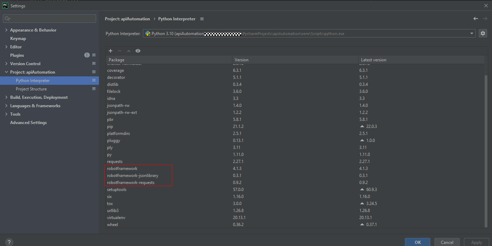
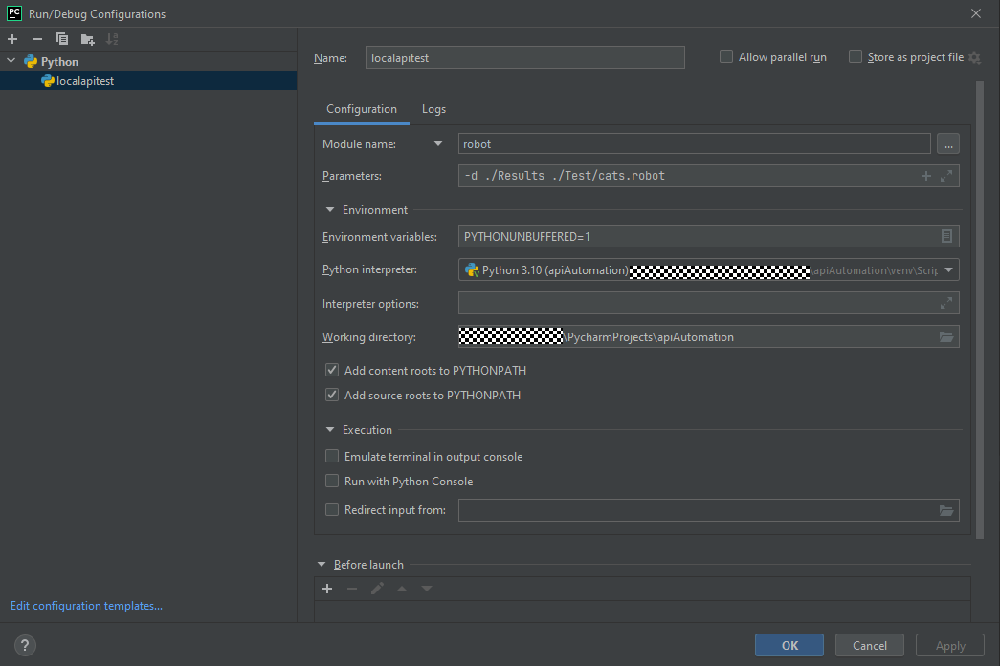

# API Automation with Robotframework
Robotframework is a Python library for robotic-process automation.

## Installation
You should install Python-3.x --> https://www.python.org/downloads/

Clone the project
```bash
https://github.com/yaqiz16/apiAutomation.git
```

Install pip packages in the project
```bash
pip install -r requirements.txt
```

## Usage
To execute Test Suite
```python
robot -d ./Results ./Test/cats.robot
```

## Report
To read the test results on the Report --> Open ./Results/report.html (on any browser)

## Option on Pycharm
You can execute the test cases with a Python VM on Pycharm





